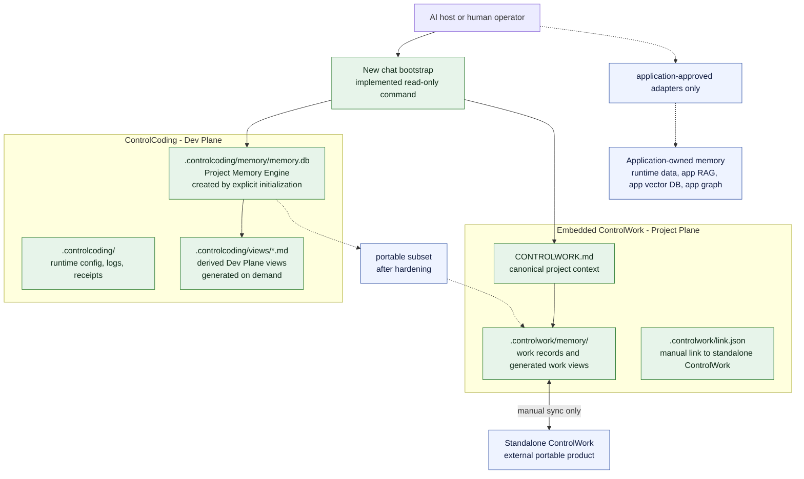
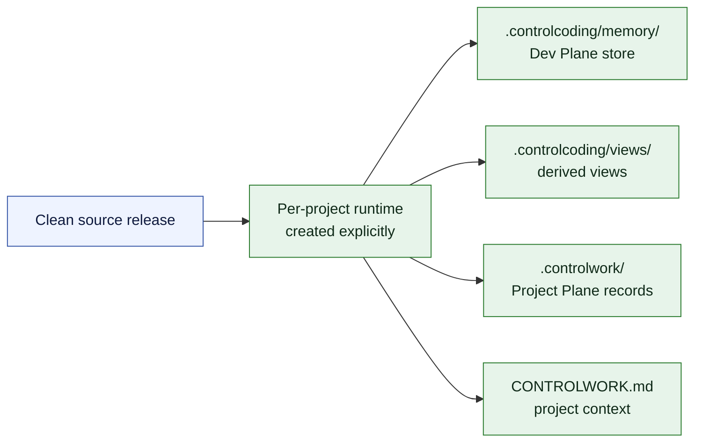
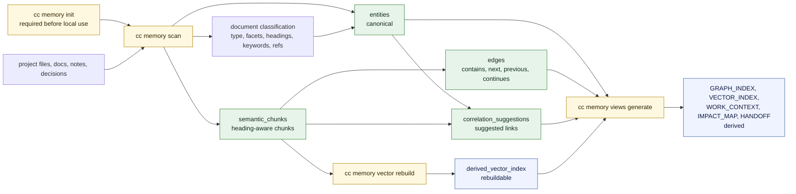
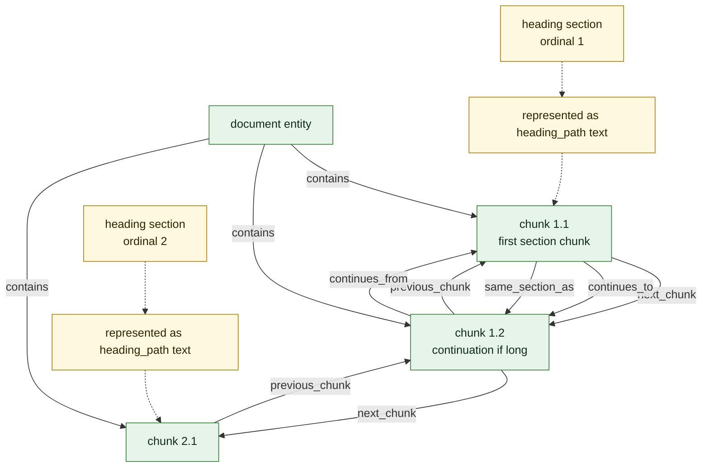
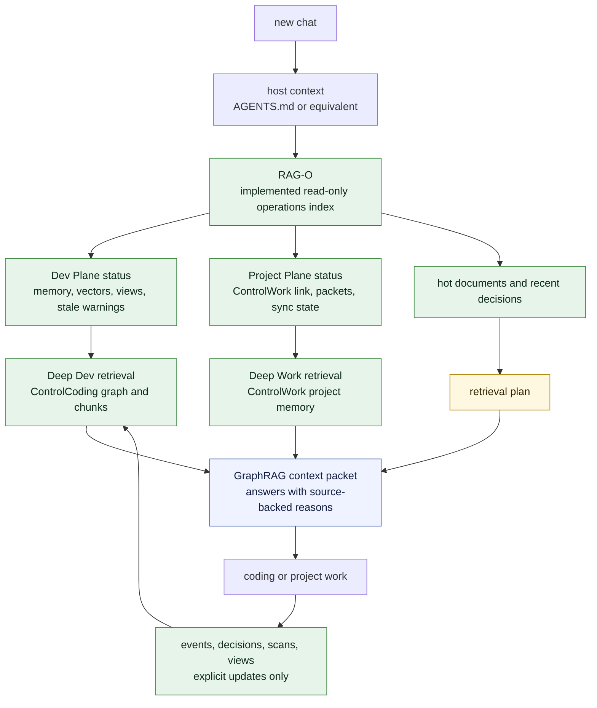
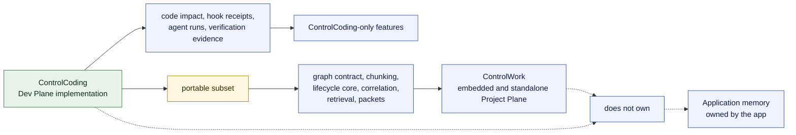

# Memory System Schema

Status: Current architecture, implemented GraphRAG increments through the
federated cross-plane packet builder, and remaining planned final extensions.

This is not a claim that every target feature is shipped.

This document explains the ControlCoding and ControlWork memory system exactly:
what exists today, what is planned, where data lives, what is canonical, what is
derived, and how the layers should interact.

No image or external link is required to understand this schema.

## Evidence Anchors

This schema is grounded in shipped repository files and public contracts:

| Claim Area | Evidence |
|---|---|
| Dev Plane SQLite schema | [`scripts/cc_memory_lib/store.py`](../scripts/cc_memory_lib/store.py) |
| semantic chunks, document-layout nodes, and continuation edges | [`scripts/cc_memory_lib/chunks.py`](../scripts/cc_memory_lib/chunks.py) |
| deterministic document classification | [`scripts/cc_memory_lib/classifier.py`](../scripts/cc_memory_lib/classifier.py) |
| correlation suggestions | [`scripts/cc_memory_lib/correlation.py`](../scripts/cc_memory_lib/correlation.py) |
| sparse vector index | [`scripts/cc_memory_lib/vector.py`](../scripts/cc_memory_lib/vector.py) |
| generated Dev Plane views | [`scripts/cc_memory_lib/views.py`](../scripts/cc_memory_lib/views.py) |
| RAG-O and startup protocol | [`scripts/cc_memory_lib/op_index.py`](../scripts/cc_memory_lib/op_index.py) |
| Session GraphRAG records and packets | [`scripts/cc_memory_lib/sessions.py`](../scripts/cc_memory_lib/sessions.py) |
| Dev GraphRAG retrieval | [`scripts/cc_memory_lib/retrieve.py`](../scripts/cc_memory_lib/retrieve.py) |
| Dev GraphRAG packet builder | [`scripts/cc_memory_lib/rag_pack.py`](../scripts/cc_memory_lib/rag_pack.py) |
| Project Plane features | [`scripts/cc_memory_lib/work_features.py`](../scripts/cc_memory_lib/work_features.py) |
| CLI command routing | [`scripts/cc.py`](../scripts/cc.py) |
| memory behavior tests | [`tests/test_cc_memory.py`](../tests/test_cc_memory.py) |
| public guide | [`docs/project-memory-engine.md`](./project-memory-engine.md) |
| shared graph contract | [`docs/memory-graph-contract.md`](./memory-graph-contract.md) |
| implementation hardening history | [`docs/memory-graphrag-release-notes.md`](./memory-graphrag-release-notes.md) |

Runtime paths such as `.controlcoding/`, `.controlwork/`, and `CONTROLWORK.md`
describe per-project storage contracts. Clean public releases ship the
implementation and templates, not generated runtime contents.

The Project Plane scan index stays outside canonical memory until reviewed and
promoted. `cc memory work-analyze` writes derived duplicate, version, and
conflict analysis. `cc memory work-review` updates scan review metadata and can
apply `ready_to_promote` only when duplicate, conflict, version, source-change,
and OCR sidecar blockers are clear. `cc memory work-promote` writes a
provenance-backed memory entry under `.controlwork/memory/`; forced promotion
over blockers or duplicate promotion checks requires `--force-note`.
`cc memory work-import-source` and `cc memory work-ocr import-sidecar` create
`needs_review` evidence with ledger provenance, not active truth.

## Visual Schema

These are text diagrams in Mermaid format. They are not external images. In a
Mermaid-aware viewer they render visually; in a plain editor they remain
readable source diagrams.

### Memory Ownership Map



### Source Release Runtime Boundary



### Current Dev Plane Memory Flow



### Current Chunk Structure



### Target Advanced GraphRAG Flow



### Portability Boundary



## Short Version

ControlCoding memory has three distinct layers:

| Layer | Storage | Owner | Current Status |
|---|---|---|---|
| Dev Plane memory | `.controlcoding/` | ControlCoding workflow | Shipped implementation; per-project data is created only by explicit initialization and commands. |
| Project Plane memory | `CONTROLWORK.md` and `.controlwork/` | ControlWork contract | Shipped portable contract for embedded or standalone use; project records are not source-release payload. |
| Application memory | Application-defined | The application being built | Outside ControlCoding ownership. ControlCoding may reference project documents, but does not own runtime truth. |

The advanced GraphRAG work should be developed first in the Dev Plane
`.controlcoding/memory/`, then the portable subset should be ported to the
Project Plane `.controlwork/`.

## Source Release Boundary

Public release evidence covers implementation code, tests, templates, and
documented contracts. Per-project databases, generated views, receipts, logs,
links, and work records are created or attached by explicit commands and are
not part of the source payload.

The Project Memory Engine and ControlWork Project Plane remain distinct
ownership layers even when both are initialized in the same adopter project.

## Terminology

| Term | Meaning |
|---|---|
| ControlCoding | The full framework for AI-assisted software development governance |
| Project Memory Engine | ControlCoding development memory engine under `.controlcoding/memory/` |
| Dev Plane | ControlCoding development workflow memory: decisions, plans, consults, agent runs, impact context, graph/search state |
| ControlWork | Portable work-memory product and contract |
| Project Plane | ControlWork embedded inside a ControlCoding project |
| Standalone ControlWork | ControlWork used without ControlCoding |
| Work Memory profile | Older ControlCoding `document-only` memory mode under `.controlcoding/`; not the same as standalone ControlWork |
| RAG-O | Implemented read-only operations index that routes to deeper memory without becoming canonical truth |
| Memory Bootstrap | Implemented read-only startup/status command used by RAG-O and new chats |
| Deep Memory | Full source-backed memory stores: Dev Plane graph, Project Plane graph, and source documents |
| Application-owned memory | Runtime memory owned by the application, such as user data, app RAG corpora, embeddings, vector DBs, and domain knowledge graphs |

## Memory Layers

### 1. Dev Plane Memory

Storage:

```text
.controlcoding/
  memory/
    memory.db
  views/
    GRAPH_INDEX.md
    VECTOR_INDEX.md
    WORK_CONTEXT.md
    IMPACT_MAP.md
    HANDOFF.md
```

Current implementation:

- SQLite schema exists in `scripts/cc_memory_lib/store.py`.
- CLI commands exist through `scripts/cc.py memory ...`.
- Semantic chunks, correlation suggestions, lifecycle workflows, vector search,
  impact/context lookup, and generated views are implemented.
- Clean release checkouts do not include initialized Dev Plane data. Adopters
  create per-project data through explicit memory commands.

Purpose:

- remember technical development decisions
- track plans, stale plans, conflicts, supersession, and legacy records
- index project files and documents as development context
- store consult and agent-run summaries
- produce impact/context views before edits
- support GraphRAG development for coding workflows

Canonical:

- SQLite entities, edges, events, sources, lifecycle records, and source
  document references are canonical for ControlCoding development memory.
- Generated Markdown views and vector indexes are derived and rebuildable.

### 2. Project Plane Memory

Storage:

```text
CONTROLWORK.md
.controlwork/
  memory/
    inbox/
    sources/
    notes/
    ideas/
    decisions/
    plans/
    outputs/
    legacy/
    views/
  config.json
  link.json
```

Current implementation:

- Embedded and standalone Project Plane modes share the portable contract.
- Linking and sync are manual and explicit.
- The portable GraphRAG subset is implemented in standalone ControlWork:
  graph contract, deterministic chunking, topic suggestions, retrieval,
  rag-pack, and file-based Session GraphRAG.
- ControlCoding-only evidence remains excluded from ControlWork.

Purpose:

- preserve project/work knowledge independent of code
- hold research, sources, requirements, decisions, plans, outputs, and handoff
- support chat continuity for project work
- remain useful before code exists or outside a coding project

Canonical:

- `CONTROLWORK.md` is the canonical work/project context.
- `.controlwork/memory/` entries are canonical project-plane records.
- Generated views, context packets, handoff packets, and Obsidian projections
  are derived.

### 3. Application-Owned Memory

Storage:

```text
Defined by the application.
```

Examples:

- production user data
- runtime domain memory
- application vector DB
- application embeddings
- application RAG corpus
- application knowledge graph
- application caches, ledgers, and data stores

Purpose:

- serve the application at runtime
- store user or domain data according to the application design

Canonical:

- the application owns this truth
- ControlCoding and ControlWork may reference project documents about it, but
  they do not become the owner of runtime truth

## Canonical Versus Derived

| Artifact | Canonical | Reason |
|---|---|---|
| `CONTROLCODING.md` | Yes | Source of ControlCoding operating rules |
| generated `AGENTS.md`, `CLAUDE.md`, `GEMINI.md` | No | Host projections derived from canonical context |
| `.controlcoding/memory/memory.db` | Yes for Dev Plane memory | Local SQLite memory store |
| `.controlcoding/views/*.md` | No | Rebuildable views |
| `.controlcoding/derived_vector_index` table | No | Rebuildable from semantic chunks |
| `.controlcoding/document_layout_nodes` table | No | Rebuildable first-class layout projection from source documents and chunks |
| `.controlcoding/document_layout_edges` table | No | Rebuildable layout projection from source documents and chunks |
| `CONTROLWORK.md` | Yes for Project Plane | Canonical project/work context |
| `.controlwork/memory/*` entries | Yes for Project Plane | Source records for work memory |
| `.controlwork/memory/views/*` | No | Rebuildable views |
| `.controlwork/context-packets/*` | No | Generated handoff/context artifacts |
| Obsidian `wiki/` projection | No | Projection of ControlWork memory |
| Application DB/vector store | Yes for application | Owned by application |

## Implemented ControlCoding Memory Features

| Feature | Current State |
|---|---|
| SQLite Project Memory Engine store | Implemented |
| Entity table | Implemented |
| Edge table | Implemented |
| Event ledger | Implemented |
| Source ledger | Implemented |
| Deterministic document classification | Implemented |
| Semantic chunks | Implemented |
| Chunk continuation edges | Implemented |
| Structural chunk metadata | Implemented |
| First-class document-layout nodes and edges | Implemented for ControlCoding Dev Plane, including explicit PDF/OCR layout sidecars and basic text PDF extraction |
| Explicit reference edges | Implemented |
| Correlation suggestions | Implemented |
| Lifecycle workflows | Implemented |
| Impact/context lookup | Implemented |
| Local sparse vector index | Implemented |
| Vector rebuild/search commands | Implemented |
| Markdown views | Implemented |
| Shared graph contract document | Implemented as G1 documentation |
| Runtime graph contract constants/status CLI | Implemented |
| Suggestion accept/reject persistence | Implemented |
| Graph CLI status/suggestions/accept/reject/around | Implemented |
| Memory Bootstrap | Implemented |
| Memory Startup Protocol | Implemented |
| RAG-O operations index | Implemented |
| Dev GraphRAG retrieval | Implemented for ControlCoding Dev Plane |
| Dev GraphRAG packet builder | Implemented for ControlCoding Dev Plane |
| Cross-plane GraphRAG packet builder | Implemented as federated read-only packet |
| Session GraphRAG storage, views, retrieval evidence, and packets | Implemented for ControlCoding Dev Plane |
| Optional semantic adapter interface | Implemented |
| Explicit local runtime semantic scoring | Implemented for `cc memory retrieve` |
| Explicit local OCR adapter interface | Implemented for `cc memory ocr status` and `cc memory ocr run` |
| Derived graph viewer/export | Implemented |

## Current Chunk And Classification Model

The implemented ControlCoding chunking model works at document and heading
level today.

Current flow:

1. `cc memory scan` discovers eligible project files.
2. Each indexed file becomes an entity in the Dev Plane memory database.
3. The classifier reads path, filename, Markdown headings, title, lifecycle,
   and a text sample.
4. Classification metadata is stored on the entity.
5. The chunker splits Markdown by heading hierarchy.
6. Long sections are split into continuation chunks.
7. The layout builder derives first-class document-layout nodes and edges from
   the same source text and chunk structure.
8. The graph stores document-to-chunk, previous/next, and continuation edges.
9. Vector rebuild derives sparse vector rows from the chunk table.

Current entity classification fields:

| Field | Purpose |
|---|---|
| `document_type` | Deterministic primary type, such as plan, decision, research, design, status, benchmark, test evidence, host context, or general document |
| `document_facets` | Lifecycle and context facets, such as active, stale, legacy, external source, or generated view |
| `classification_reasons` | Why the classifier chose the type |
| `heading_titles` | Extracted Markdown headings |
| `heading_keys` | Normalized heading terms for correlation |
| `keywords` | Deterministic keyword list |
| `explicit_refs` | Local Markdown and code-path references extracted from links and inline file mentions |

Current chunk fields:

| Field | Purpose |
|---|---|
| `id` | Stable chunk identifier |
| `document_id` | Parent entity id |
| `source_path` | Source file path |
| `heading_path` | Markdown heading hierarchy, for example `Architecture > Memory` |
| `ordinal` | Section order in the document |
| `sequence_index` | Split order inside the same section |
| `parent_chunk_id` | First chunk of a split section |
| `previous_chunk_id` | Previous chunk in reading order |
| `next_chunk_id` | Next chunk in reading order |
| `lifecycle` | Lifecycle copied from the source entity |
| `content_hash` | Hash of chunk content |
| `summary` | First useful text line or heading fallback |
| `keywords` | Deterministic keywords for retrieval |
| `metadata` | JSON structural metadata: source title, heading level, structural level/types, block type, semantic role, topics, subtopics, domains, relation strength, context policy, source location, and extraction confidence |
| `content_preview` | Bounded text preview stored in the DB |

Current chunk edges:

| Edge | Meaning |
|---|---|
| `contains` | Document entity contains chunk |
| `next_chunk` | Reading-order next chunk |
| `previous_chunk` | Reading-order previous chunk |
| `continues_to` | First part of a long section continues to another chunk |
| `continues_from` | Continuation chunk points back to the first section chunk |
| `same_section_as` | Continuation chunks belong to the same heading section |

Implemented document-layout tables:

| Table | Purpose |
|---|---|
| `document_layout_nodes` | Rebuildable first-class layout nodes for document, title, chapter, section, subsection, paragraph, table, table cell, schema, schema field, page, annotation, figure, image, caption, footnote, and margin note. |
| `document_layout_edges` | Rebuildable layout edges such as contains, next_layout, previous_layout, represented_by_chunk, has_layout_node, in_page, caption_for, footnote_for, table_cell_of, schema_field_of, visual_adjacent, visual_above, visual_below, visual_left_of, visual_right_of, and visual_overlaps. |

Implemented layout node types:

| Node Type | Purpose |
|---|---|
| `document` | Whole source document projection. |
| `title` | Main document title derived from the first top-level heading or filename. |
| `chapter` | Top-level heading division. |
| `section` | Second-level heading division. |
| `subsection` | Third-level or deeper heading division. |
| `paragraph` | Atomic prose, list, quote, or code-like block when it is not classified as a table, schema, or annotation. |
| `table` | Coherent Markdown table block. |
| `table_cell` | Header or body cell extracted from a Markdown table block. |
| `schema` | Mermaid, JSON, YAML, diagram, interface, or schema-like block. |
| `schema_field` | Field extracted from a JSON or key/value schema-like block. |
| `page` | Page marker when source text exposes page information. |
| `annotation` | Note, warning, comment, review note, or extracted annotation marker. |
| `figure` | Externally extracted PDF/OCR figure block from layout sidecar data. |
| `image` | Externally extracted image block from layout sidecar data. |
| `caption` | Caption block that may point to a figure or image block. |
| `footnote` | Footnote block that may point to a target block. |
| `margin_note` | Margin note block from layout sidecar data. |

Inspect layout for one document with:

```bash
python scripts/cc.py memory layout --project-root . docs/plan.md
```

Current limitations:

- Document, title, chapter, section, subsection, paragraph, page, table,
  table cell, schema, schema field, annotation, figure, image, caption,
  footnote, and margin note are first-class rebuildable layout nodes in
  ControlCoding Dev Plane.
- Layout nodes are projections. Source documents, entities, chunks, and
  explicit memory records remain authoritative.
- Tables, schemas, and annotations are classified in chunk metadata and kept as
  coherent chunk blocks when detected.
- Markdown tables emit table-cell child nodes. JSON and simple key/value schema
  blocks emit schema-field child nodes.
- Page-level metadata is available from source text page markers or from
  explicit PDF/OCR layout sidecars.
- `.layout.json`, `.ocr.json`, `.pdf.layout.json`, and `.pdf.ocr.json`
  sidecars can carry page, bounding box, normalized bounding box, page size,
  coordinate system, source document path, extraction method, block id, target
  block id, and OCR confidence.
- Sidecars can expose either page `blocks` or page-level `tables`, `figures`,
  `images`, `captions`, `footnotes`, `annotations`, and `marginNotes`
  collections. Structured table cells and schema fields are preserved as child
  layout nodes with row, column, field, and coordinate metadata when provided.
- Sidecar blocks with bounding boxes emit bounded page-local visual relations:
  nearest above, below, left, right, and overlap edges when coordinates support
  them.
- Simple unencrypted PDFs with readable content streams can be scanned directly
  with stdlib-only text extraction. This creates page-marked chunks and layout
  nodes, but it does not provide native PDF bounding boxes.
- A recognized sidecar must expose a top-level `pages` list. If that shape is
  missing or invalid, scan preserves the path-backed entity but does not create
  semantic chunks or layout nodes from raw JSON.
- Topic, subtopic, domain, semantic role, relation strength, and context policy
  are deterministic metadata derived from path, headings, keywords, and local
  text markers.
- Robust native PDF layout parsing and OCR execution are not implemented.
  ControlCoding can ingest externally extracted layout sidecars and preserve
  their coordinates, and it can extract text from simple unencrypted PDFs.

Current advanced structure:

| Structural Type | Status |
|---|---|
| `document`, `title`, `chapter`, `section`, `subsection`, `paragraph`, `table`, `table_cell`, `schema`, `schema_field`, `page`, `annotation`, `figure`, `image`, `caption`, `footnote`, `margin_note` | Implemented as first-class rebuildable layout nodes. |
| `subtitle` | Represented through heading metadata and section nodes; not yet emitted as a separate node type. |
| `topic`, `subtopic`, `domain` | Implemented as deterministic metadata on chunks and layout nodes, not as independent graph nodes. |

Why this matters:

- Retrieval should return complete meaning, not isolated text fragments.
- Tables and schemas should not be split in ways that lose row/column or
  field/relationship context.
- Chapter, page, and paragraph metadata should help trace an answer back to
  the exact source location.
- Topic, subtopic, and domain should help route queries across many documents
  without mixing unrelated contexts.
- Strong structural proximity should be used as a ranking signal in GraphRAG.

Accurate statement: ControlCoding now supports heading-aware semantic chunking,
continuation edges, deterministic structural chunk metadata, a rebuildable
first-class document-layout graph for text and Markdown-like sources, and
explicit PDF/OCR layout sidecar ingestion with page coordinates. It also has
basic text extraction for simple unencrypted PDFs. It is not yet a robust PDF
layout parser or OCR engine.

## Implemented ControlWork Features

| Feature | Current State |
|---|---|
| `CONTROLWORK.md` canonical context | Implemented |
| `.controlwork/memory/` areas | Implemented |
| Basic lifecycle states | Implemented |
| Capture/category/checkpoint workflows | Implemented in standalone ControlWork and embedded path |
| Context packets | Implemented |
| Handoff packets | Implemented |
| Generated views | Implemented |
| Obsidian projection | Implemented |
| Read-only MCP tools | Implemented |
| Import/attach/sync/export bridge from ControlCoding | Implemented |
| Advanced graph contract implementation | Implemented portable subset |
| Deterministic chunking | Implemented portable subset |
| Deterministic topic suggestions | Implemented portable subset |
| Suggestion accept/reject persistence | Implemented portable subset |
| File-derived graph store | Implemented portable subset |
| Derived graph export/viewer | Implemented portable subset |
| Work GraphRAG retrieval | Implemented portable subset |
| Work GraphRAG packet | Implemented portable subset |
| Portable Session GraphRAG | Implemented portable subset |
| Drift-aware update requests | Implemented in ControlCoding bridge |

## Current Sync Model

Current synchronization is manual and explicit.

Commands:

```bash
python scripts/cc.py memory work-status --project-root .
python scripts/cc.py memory work-attach --project-root . ../ControlWorkProject
python scripts/cc.py memory work-sync --project-root . --direction pull --force
python scripts/cc.py memory work-sync --project-root . --direction push --force
python scripts/cc.py memory work-import --project-root . ../ControlWorkProject
python scripts/cc.py memory work-export --project-root . ../WorkOnlyFolder
```

Current behavior:

- no background watcher
- no constant connection
- no automatic update of ControlWork when plans change
- no automatic pull/push
- no silent overwrite
- sync requires explicit command and `--force`

Planned behavior:

- detect drift
- detect stale graph/search/views/packets
- report changed plans, decisions, sources, and outputs
- create update requests
- recommend maintenance commands
- still avoid hidden automatic writes

Current implemented bridge behavior:

- `cc memory work-status` fingerprints embedded ControlWork and linked
  standalone ControlWork when a link exists.
- It reports whether the embedded and external fingerprints differ.
- It separately reports semantic actionable drift for shared config, canonical
  context, category registry, and Project Plane memory content.
- Expected embedded versus standalone distribution text can differ without
  creating a sync request when the shared contract and memory content match.
- Category audit timestamps are ignored during semantic category comparison.
- It reports stale embedded ControlWork views, missing context packets, and
  Obsidian projection drift when the wiki projection exists.
- It emits update requests with explicit maintenance commands.
- It does not pull, push, regenerate, sync, or write hidden changes.

## Implemented Memory Bootstrap And RAG-O

Memory Bootstrap is an implemented read-only derived status command. RAG-O is
the RAG Operations Index that builds on bootstrap status and adds graph status,
RAG routes, packet pointers, Project Plane drift, action queue, and commit
hygiene. RAG-O is not a retrieval or generation engine.

Purpose:

- fast startup for a new chat
- route the AI to the right memory store
- show stale indexes and stale packets
- show current focus and hot documents
- recommend refresh commands

Memory Bootstrap reports:

- whether `.controlcoding/memory/` exists
- whether `.controlwork/` exists
- whether standalone ControlWork is linked
- last scan timestamp
- last vector rebuild timestamp
- last views generation timestamp
- last ControlWork sync timestamp and direction
- graph contract version
- stale derived artifacts
- hot documents
- recent decisions
- warnings for the next chat
- action queue for operational maintenance
- RAG routes to deeper stores
- commit hygiene for local-only memory state

Memory Bootstrap and RAG-O must not:

- replace Dev Plane memory
- replace Project Plane memory
- replace source documents
- silently mutate ControlWork
- silently pull or push external memory

Command:

```bash
python scripts/cc.py memory bootstrap --project-root . --scope dev --topic "GraphRAG"
```

RAG-O command:

```bash
python scripts/cc.py memory op-index --project-root . --scope dev --topic "GraphRAG"
```

Bootstrap output includes:

- memory stores
- current focus
- recent changes
- stale derived artifacts
- recommended refresh commands
- Project Plane status
- Dev Plane status
- top documents to retrieve
- warnings before work
- action queue
- RAG route table
- commit hygiene

It exits successfully even when Dev Plane memory is missing, because its job is
to report status and recommend explicit maintenance commands. It does not call
schema migration helpers, create `.controlcoding/`, generate views, rebuild
vectors, or synchronize ControlWork.

`cc memory op-index` builds on Memory Bootstrap, graph status, and Project Plane
drift awareness. It is also read-only. It does not retrieve answers, generate
answers, create packets, accept suggestions, sync ControlWork, or stage files.
Its output is a projection for operational coordination, not canonical memory.

## Implemented Session GraphRAG In ControlCoding

`cc memory session` records explicit work sessions for cross-chat continuity.
`cc memory session-pack` builds session packets. `cc memory retrieve` includes
session records as lower-trust Dev Plane traceability evidence. Session
GraphRAG is traceability storage, not canonical project truth by itself.

Implemented commands:

```bash
python scripts/cc.py memory session start --project-root . --topic "GraphRAG implementation" --mode continue_previous_work
python scripts/cc.py memory session link --project-root . <session-id> --commit <sha>
python scripts/cc.py memory session link --project-root . <session-id> --type changes_doc --target docs/project-memory-engine.md
python scripts/cc.py memory session note --project-root . <session-id> "Follow up on RAG-O integration." --kind followup
python scripts/cc.py memory session close --project-root . <session-id> --status needs_followup --summary "Implemented the session CLI base."
python scripts/cc.py memory session list --project-root . --topic "GraphRAG"
python scripts/cc.py memory session show --project-root . <session-id>
python scripts/cc.py memory session views --project-root .
python scripts/cc.py memory session-pack --project-root . --topic "GraphRAG" --status all
python scripts/cc.py memory startup --project-root . --scope dev --topic "GraphRAG"
```

Current SQLite additions:

| Table | Purpose |
|---|---|
| `session_records` | One structured session record with topic, mode, scope, lifecycle-like status, summary, lists of linked evidence, and structured data. |
| `session_edges` | Session-to-evidence links such as commits, docs, files, commands, packets, decisions, and follow-ups. |

Current behavior:

- `cc memory session views` generates rebuildable session views.
- RAG-O reads session state without writing.
- Dev GraphRAG retrieval demotes session records as non-canonical traces unless
  they carry linked evidence.
- Session packets include citations, edges used, warnings, excluded records,
  and next reads.
- `cc memory startup` prints a read-only host startup protocol with explicit
  visible commands. It does not create, close, sync, rebuild, or mutate memory.

Current limits:

- ControlWork portable session records are file-based under `.controlwork/sessions/` and exclude ControlCoding-only evidence.
- host startup guidance is implemented as an advisory visible protocol, not
  automatic command execution

## Implemented Dev GraphRAG Retrieval And Planned Deep Retrieval

`cc memory retrieve` now implements hybrid retrieval over the ControlCoding Dev
Plane store. It ranks candidate entities and chunks with text, local sparse
vector matches, optional explicit semantic adapter scores, graph proximity,
lifecycle, confidence, recency, and source trust. It also reports exclusions
and demotions.

The broader deep retrieval target should query each authoritative memory store.

| Query Target | Store |
|---|---|
| technical coding context | Dev Plane `.controlcoding/memory/`, implemented by `cc memory retrieve` |
| project/work context | Project Plane `.controlwork/`, implemented in the portable ControlWork subset through `cw.py retrieve` and `cw.py rag-pack`; embedded ControlCoding also has `work-context-pack` |
| runtime/domain data | application-owned memory, only through application-approved adapters |

The implemented ControlCoding retriever combines:

- text score
- sparse vector score
- explicit local runtime semantic score when configured
- graph proximity
- lifecycle weight
- confidence weight
- recency
- source trust
- exclusion and demotion reasons

Optional semantic scoring remains explicit-only through configured adapters.
The implemented local runtime adapter runs only when project configuration
selects `local_runtime_v1`; the default remains local sparse scoring. Project
Plane retrieval is implemented in standalone ControlWork as a portable,
file-derived subset and remains separate from ControlCoding Dev Plane SQLite
retrieval.

## Implemented Dev GraphRAG Packet Builder

`cc memory rag-pack` builds a Markdown packet from ControlCoding hybrid
retrieval. With `--json`, it returns the same packet plus structured citations,
edges used, warnings, excluded records, demotion counts, and next-read
recommendations.

Command:

```bash
python scripts/cc.py memory rag-pack --project-root . "GraphRAG packet evidence" --limit 10
```

Current scope:

- Uses ControlCoding Dev Plane entities, chunks, edges, suggestions, lifecycle
  state, and local sparse vectors.
- Emits citations as local path and heading pointers.
- Lists graph edges that contributed to selected citations.
- Separates stale, conflicting, needs_review, legacy, and superseded warnings.
- Reports excluded records and demotions from retrieval.
- Recommends next reads and graph inspection commands.

Current limits:

- Project Plane packeting is available through embedded `work-context-pack` and
  standalone ControlWork `cw.py rag-pack`.
- Application-owned memory remains outside ControlCoding ownership and should
  be accessed only through application-approved adapters.

## Implemented Cross-Plane GraphRAG Packet Builder

`cc memory cross-pack` builds a federated read-only packet across implemented
memory planes:

```bash
python scripts/cc.py memory cross-pack --project-root . "GraphRAG packet evidence" --limit 10
```

The packet includes:

- Dev GraphRAG citations, retrieval signals, graph edges, and warnings.
- Project Plane ControlWork citations selected from `.controlwork/memory/` and
  `CONTROLWORK.md`.
- Session GraphRAG citations, session edges, and follow-up warnings.
- RAG-O routes, index health, action queue, and commit hygiene.

Current limits:

- It is a packet builder, not an answer generation engine.
- It keeps Dev Plane, Project Plane, Session GraphRAG, and application-owned
  memory separate instead of creating a merged source of truth.
- It does not refresh views, sync ControlWork, accept graph suggestions, create
  sessions, or access application-owned memory directly.

## Implemented Optional Semantic Adapter Interface

`cc memory semantic status` reports the semantic adapter registry without
executing adapters. `cc memory retrieve` can execute the local runtime adapter
only when `semantic_adapters.json` explicitly selects it.

Command:

```bash
python scripts/cc.py memory semantic status --project-root .
```

Current adapter contract:

| Adapter | Status | Boundary |
|---|---|---|
| `local_sparse_v1` | Default and available | Rebuildable local sparse vector index, no network |
| `local_runtime_v1` | Optional | Available only when explicitly enabled with a local command. Retrieval sends JSON over stdin and reads JSON scores from stdout. |
| `official_api_v1` | Optional | Available only when explicitly configured with provider, model, and API key environment variable. It remains explicit-only and is not the default retrieval path. |

Policy:

- Local sparse retrieval remains the default.
- Status inspection does not execute local runtime commands.
- Local runtime scoring is invoked only by retrieval after explicit project
  configuration.
- Official API adapters must use official APIs and explicit project
  configuration.
- Consumer login reuse and token reuse are not allowed.

## Implemented Explicit OCR Adapter Interface

`cc memory ocr status` reports the OCR adapter registry without executing
adapters. `cc memory ocr run` can execute a local runtime adapter only when
`ocr_adapters.json` explicitly selects `local_runtime_v1` with a command.

Commands:

```bash
python scripts/cc.py memory ocr status --project-root .
python scripts/cc.py memory ocr run --project-root . docs/report.pdf --output docs/report.pdf.ocr.json
python scripts/cc.py memory ocr run --project-root . docs/report.pdf --force
```

Current adapter contract:

| Adapter | Status | Boundary |
|---|---|---|
| `local_runtime_v1` | Optional | Available only when explicitly enabled with a local command. The command receives JSON over stdin and returns layout sidecar JSON on stdout. |

G14.2 adapter request metadata:

| Field | Meaning |
|---|---|
| `sourceType` | Lowercase source extension such as `pdf`, `png`, or `jpg`. |
| `sourceSizeBytes` | Source file size at execution time. |
| `sourceSha256` | SHA-256 digest of the source file. |
| `outputPath` | Project-relative sidecar output path. |
| `outputAbsolutePath` | Absolute sidecar output path inside the project root. |
| `sidecarSchema` | Requested sidecar contract, currently `cc-layout-sidecar/v1`. |
| `acceptedSourceTypes` | Source types accepted by the configured local runtime. |

Policy:

- OCR execution is explicit-only.
- Status inspection does not execute local runtime commands.
- Status reports command executability, accepted source types, timeout, and
  configuration issues.
- Adapter output is validated as a sidecar with a top-level `pages` list before
  it is written.
- Adapter output `sourcePath`, when supplied, must match the requested source.
- The sidecar is written only inside the project root.
- Existing sidecar output is not overwritten unless `--force` is passed.
- `cc memory ocr run` does not scan automatically. Run `cc memory scan`
  explicitly after reviewing or accepting the sidecar.
- Consumer login reuse and token reuse are not allowed.

## Implemented Derived Graph Viewer And Export

`cc memory graph export` exports a derived graph projection as JSON or a
lightweight HTML viewer.

Command:

```bash
python scripts/cc.py memory graph export --project-root . --format html --output graph-view.html
```

Filters:

- `--type` filters entity, chunk, graph node, or document type.
- `--lifecycle` filters node lifecycle.
- `--confidence` filters canonical edges or suggestion confidence.
- `--source` filters `dev`, `project`, `application`, or path text.

Boundary:

- The export is derived.
- The SQLite memory database and source files remain authoritative.
- HTML output is a projection for inspection, not an editable source of truth.

## New Chat Startup Flow

Target flow for a new AI chat:

1. Read `AGENTS.md` or the active host context.
2. Run or request `cc memory bootstrap`.
3. If bootstrap says Dev Plane memory is missing, decide whether to initialize
   Project Memory Engine.
4. If bootstrap says scans/views/vectors are stale, run the recommended refresh
   commands.
5. Query Dev Plane memory for coding work with `cc memory retrieve`.
6. Query Project Plane memory for research, requirements, plans, or product
   context.
7. Keep application-owned memory separate unless the project explicitly exposes
   documents or adapters.

Fallback commands when a user wants deeper inspection:

```bash
python scripts/cc.py memory status --project-root .
python scripts/cc.py memory scan --project-root .
python scripts/cc.py memory context --project-root . "<topic>"
python scripts/cc.py memory impact --project-root . "<path-or-topic>"
python scripts/cc.py memory work-status --project-root .
python scripts/cc.py memory work-context-pack --project-root . --scope general --topic "<topic>"
```

## Dogfood Flow For This Repository

ControlCoding should dogfood Project Memory Engine after the graph contract
baseline is stable.

Recommended sequence:

```bash
python scripts/cc.py memory init --project-root . --mode full --project-short CC
python scripts/cc.py memory scan --project-root .
python scripts/cc.py memory vector rebuild --project-root .
python scripts/cc.py memory views generate --project-root .
```

After G1:

```bash
python scripts/cc.py memory graph status --project-root .
```

Bootstrap command:

```bash
python scripts/cc.py memory bootstrap --project-root . --scope dev --topic "GraphRAG"
```

## Porting Rule

Develop first in ControlCoding when the feature needs:

- `.controlcoding/memory/`
- code-aware impact
- agent runs
- consults
- verification receipts
- hook receipts
- development workflow evidence

Port to ControlWork when the feature is portable Project Plane behavior:

- document chunking
- graph contract
- lifecycle core
- correlation suggestions
- source/decision/plan/note/output nodes
- retrieval with reasons
- GraphRAG packet for work context
- read-only graph inspection
- drift-aware update requests

Keep in ControlCoding when the feature is code-specific:

- source-code file impact
- module proximity
- changed files from agent runs
- hook receipts
- verification receipts
- CodeWarden or promotion-specific evidence

## Release Rule

Clean public source releases should ship:

- implementation code
- templates
- tests
- public docs

Clean public source releases should not copy local runtime state:

- `.controlcoding/`
- `.controlwork/`
- `CONTROLWORK.md` from the private working copy
- local receipts
- local logs
- local graph DBs
- generated local views

Fresh adopters initialize their own memory state with the documented commands.

## G10 And G11 Release Hardening Notes

The G10 and G11 hardening passes keep the public claim boundary explicit:

- Dev GraphRAG features listed as implemented are backed by
  CLI commands and tests.
- ControlWork has only the portable Project Plane and Session GraphRAG subset.
- Cross-plane GraphRAG is implemented as a federated packet builder, not as an
  autonomous answer engine.
- Derived state is rebuildable and should not be treated as source truth.
- Drift awareness reports update requests, but it does not auto-sync.
- Optional API-backed semantic adapters remain explicit-only.
- Generated `.controlcoding/`, `.controlwork/`, and `CONTROLWORK.md`
  contents are not part of the clean source payload.

See `docs/memory-graphrag-release-notes.md` for rebuild commands, privacy notes,
verification commands, and current limitations.
